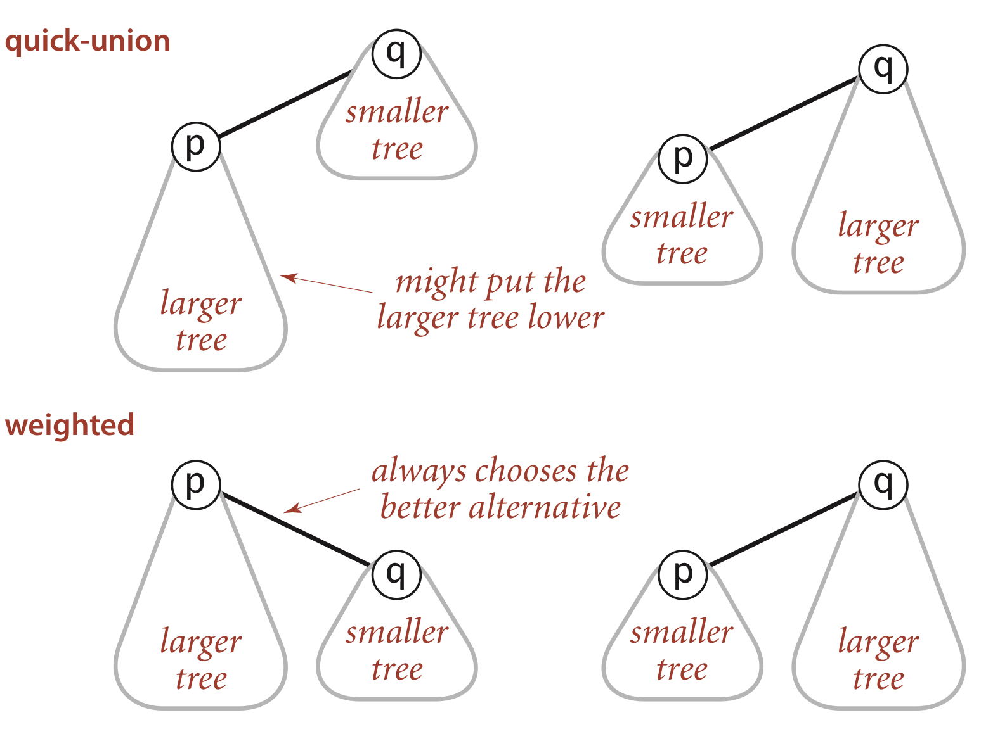
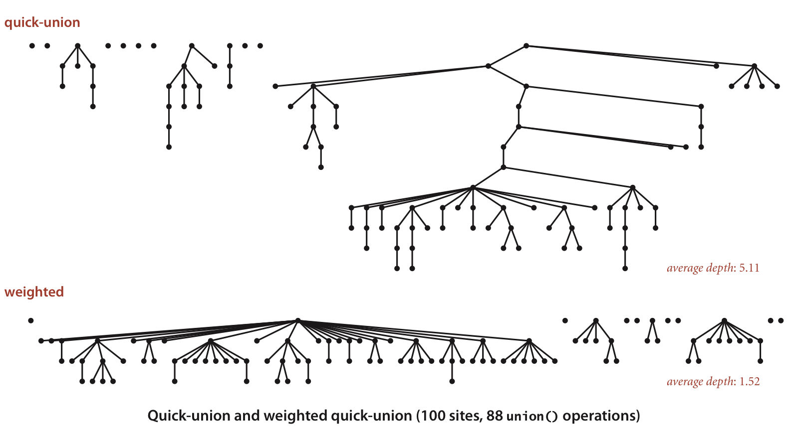

# Union-Find
## Problem to slove
Consider this situation: there're large amount of objects, each object are connected with an object directly or indirectly.  
In this case, we have to judge if two given objects are connected.
## Definition
### Connection
We start with dynaminc connectivities.  
Provided that the input is a sequence of pairs of integers.  
Each pair of integers, for example, p and q, implies that p and q are connected.  
Connected is a equivalence relation, which means:
- Reflexive: p is connected to q
- Symmetric: If p is connected to q, then q is connected to p
- Transitive: If p is connected to q, q is connected to r, then p is connected to r
### Connected component
Provided that p and q are connected, this connection is the smallest scale of connected component.  
In this case, connected component is kind of connection net, each integer from a connect component are connected directly or indirectly.  
As the example I given, p is connected to q, q is connected to r. Then p, q and r form a connected component. p is connected to r by q.
## Model design
```C++
class WeightedQuickUnionUF{
private:
    static int* id;                          // to store index
    static int* sz;                          // to store each integer's size
    static int count;                        // record the number of connected component
    int find(int p);                         // find the input integer's root integer
public:
    explicit WeightedQuickUnionUF(int N);    // construct func
    int findCount();                         // just return count
    bool isConnected(int p, int q);          // judge if two given numbers are connected
    void connect(int p, int q);              // connect p with q
};
```
Provide that there're no connected integers.  
If p is connected to q like this:
```C++
p -> q -> r
```
we can operate like this:
```C++
id[p] = q;
id[q] = r;
```
after that:
```C++
sz[p] = 1;
sz[q] = 2;
sz[r] = 3;
count = 1;
find[p] = r;
```


## Code
Language supported: C++
- [hpp](./Class_UF.hpp)
- [cpp](./Class_UF.cpp)
```C++
class WeightedQuickUnionUF{
private:
    int WeightedQuickUnionUF::find(int p) {
        if(p != id[p]){
            id[p] = id[id[p]];
            p = id[p];
        }
        return p;
    }
public:
    WeightedQuickUnionUF::WeightedQuickUnionUF(int N){
        count = N;
        id = new int [N];
        sz = new int [N];
        for(int i = 0; i < N; ++i){
            id[i] = i;
            sz[i] = 1;
        }
    }
    
    int WeightedQuickUnionUF::findCount(){
        return count;
    }
    
    bool WeightedQuickUnionUF::isConnected(int p, int q) {
        return find(p) == find(q);
    }
    
    void WeightedQuickUnionUF::connect(int p, int q) {
        int i = find(p);
        int j = find(q);
        if(i == j) return;
        if(sz[i] < sz[j]){
            id[i] = j;
            sz[j] += sz[i];
        }
        else{
            id[j] = i;
            sz[i] += sz[j];
        }
        count--;
    }
}
```

## Descriptions
### Path compression
Note that, there's one line in func find(int p):
`
id[p] = id[id[p]];
`
seems to be redundant.  
In fact, this operation means path compression.  
Imagine that we have connected component like this:
```C++
p -> q -> r -> z
```
when we do `find(p);`, we can get new connected component like this:
```C++
  z
  |
  r
 / \
p   q
```
which can reduce computation cost.
### Weighted
Provided that tree(a.k.a. connected component) p is larger than q, if we connect p to q, may cause new tree q becomes deeper which may cause more computation cost.

Rather than arbitrarily connecting the second tree to the first tree,
 we keep track of the size of each tree and always connect the smaller tree to the larger.

As the follow images illustrate:





 